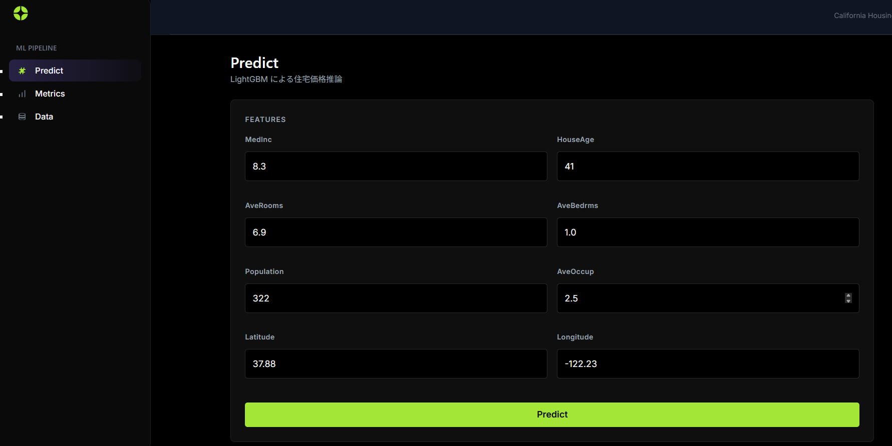
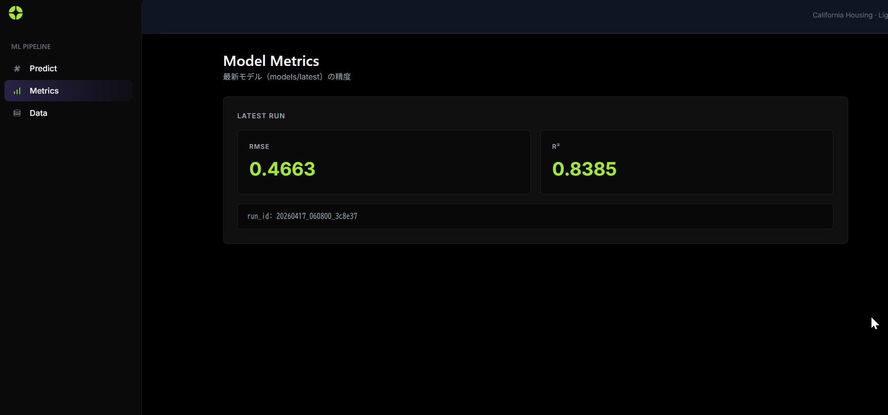
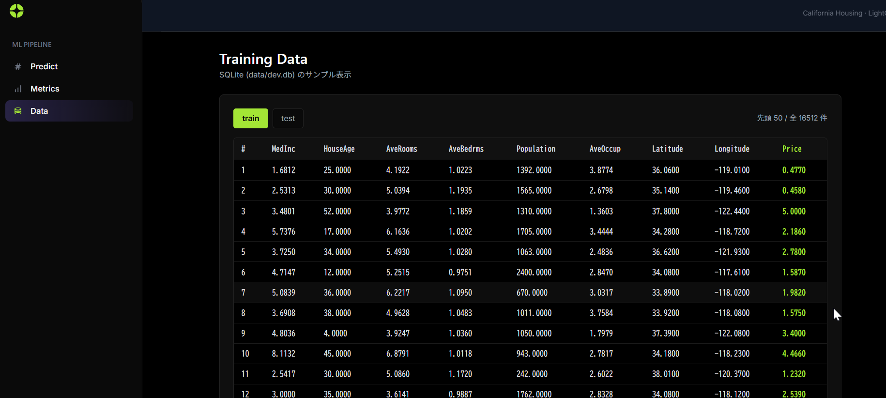

# ML Pipeline — カリフォルニア住宅価格予測

LightGBM によるカリフォルニア住宅価格予測パイプライン。
MLOps 教育用途として、Docker Compose で学習から推論 API まで完結する構成。

## クイックスタート

```bash
# Docker でデータ投入 → 学習 → API 起動
make all
make serve
```

ブラウザで http://localhost:8000/ にアクセスすると予測フォームが表示される。

## コマンド一覧 (Makefile)

| コマンド | 説明 |
|---|---|
| `make build` | Docker イメージビルド |
| `make seed` | sklearn データを PostgreSQL に投入 |
| `make train` | LightGBM モデル学習 → `models/{run_id}/` に保存 |
| `make serve` | FastAPI 推論サーバー起動 (port 8000) |
| `make test` | pytest 全テスト実行 (ローカル) |
| `make all` | build → seed → train を順番に実行 |
| `make down` | Docker Compose 停止 |
| `make clean` | Docker 停止 + 生成ファイルをすべて削除 |

Makefile は `scripts/` 配下のシェルスクリプトに委譲する構成。

## アーキテクチャ

```
PostgreSQL (docker-compose: postgres サービス)
  → ml/pipeline: Repository パターンでデータ取得
    → ml/pipeline: 前処理 (欠損値補完・外れ値キャップ・対数変換)
      → ml/pipeline: 特徴量エンジニアリング (BedroomRatio・RoomsPerPerson)
        → ml/trainer: LightGBM 学習
        → ml/evaluation: 精度評価 (RMSE, R²) + W&B ログ
          → models/{run_id}/ に保存 + PostgreSQL に精度記録 + latest 更新
            → api: FastAPI で推論 (前処理込み) + Web UI
```

### パッケージ構成

| パッケージ | 責務 |
|---|---|
| `src/ml/pipeline/` | データパイプライン + オーケストレーション (エントリーポイント) |
| `src/ml/trainer/` | LightGBM 学習アルゴリズム |
| `src/ml/evaluation/` | 精度評価 (RMSE, R²) + W&B 実験ログ |
| `src/api/` | FastAPI 推論 API + Jinja2 フロントエンド |
| `src/share/` | 共通定義 (特徴量カラム, 設定ベースクラス, ロギング, Run ID 生成) |

### 技術スタック

| 用途 | ツール |
|---|---|
| 学習 | LightGBM |
| データ | PostgreSQL 16 + sklearn California Housing |
| 評価 | numpy 自前実装 (RMSE, R²) |
| 実験ログ | W&B (オプション) |
| 推論 API | FastAPI + uvicorn + Jinja2 |
| 設定管理 | pydantic-settings + .env |
| インフラ | Docker Compose |

## Docker サービス

| サービス | Image / Dockerfile | ポート | 用途 |
|---|---|---|---|
| postgres | postgres:16 | 5432 | データ永続化 (volume: `postgres_data`) |
| seed | Dockerfile.trainer | — | PostgreSQL データ投入 (run して終了) |
| trainer | Dockerfile.trainer | — | 学習 (seed 完了後に実行) |
| api | Dockerfile.api | 8000 | FastAPI 推論 + Web UI |

## モデルバージョニング

学習を実行するたびに一意な Run ID (`YYYYMMDD_HHMMSS_{UUID}`) が付与され、モデルが蓄積される。

```
models/
├── 20260416_222525_5bfd5f/   ← 1回目
│   ├── model.lgb
│   └── metrics.json
├── 20260416_222540_05f983/   ← 2回目
│   ├── model.lgb
│   └── metrics.json
└── latest -> 20260416_222540_05f983
```

API は `models/latest/model.lgb` を参照するため、再学習後にサーバーを再起動すれば最新モデルに切り替わる。

## 推論 API

```bash
# Web UI
open http://localhost:8000/

# ヘルスチェック
curl http://localhost:8000/health

# 予測
curl -X POST http://localhost:8000/predict \
  -H "Content-Type: application/json" \
  -d '{
    "MedInc": 8.3,
    "HouseAge": 41,
    "AveRooms": 6.9,
    "AveBedrms": 1.0,
    "Population": 322,
    "AveOccup": 2.5,
    "Latitude": 37.88,
    "Longitude": -122.23
  }'
# → {"predicted_price": 4.2103}
```

## W&B 連携

`.env` に API キーを設定するとクラウドにログ送信。未設定時は offline モードで動作し、パイプライン本体の動作には影響しない。

```
WANDB_API_KEY=your_key_here
```

## テスト

```bash
make test                          # 全テスト
./scripts/test.sh -k test_train    # 単体テスト指定
```

## ドキュメント

- [設計書](docs/設計書.md) — 全体設計・本番 (GCP) 対応表・フェーズ計画
- [運用手順書](docs/運用.md) — セットアップ・実行手順・環境変数一覧

## スクリーンショット

### 推論フォーム (`/`)



### モデルの精度評価 (`/metrics`)



### 学習データサンプル (`/data`)




https://youtu.be/FV-Sd635pPk