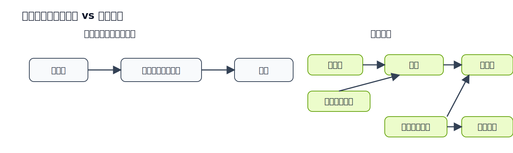
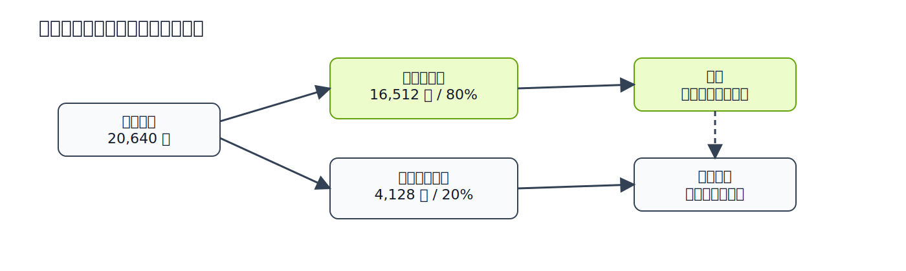

# 機械学習入門

**ITエンジニア向け**

California Housing 価格予測プロジェクトで学ぶ
機械学習の基本概念

---

## 今日のアジェンダ

| フェーズ | ねらい | 扱う技術・概念 |
|---|---|---|
| 1. 概念理解 | ML の基本語彙をつかむ | 機械学習 / モデル / 特徴量 |
| 2. データ準備 | 学習できる入力に整える | 特徴量エンジニアリング / 訓練・テスト分割 / 前処理 |
| 3. モデル構築 | 予測器を作る | LightGBM / ハイパーパラメータ / 学習 |
| 4. モデル確認 | 性能を測る | RMSE / R² / オフライン評価 |
| 5. 利用と運用 | 作ったモデルを使い続ける | 推論 / バージョニング / W&B |

---

## 今日の見取り図

```text
概念理解
  ↓
データ準備
  ↓
モデル構築
  ↓
モデル確認
  ↓
利用と運用
```

各ブロックで「何を作る段階か」を意識すると、
技術の切り替わりを追いやすい

---

## 機械学習とは

人が **ルールを明示的にプログラム** するのではなく、
データからパターンを **自動的に学習** させるアプローチ。

| 従来のプログラミング | 機械学習 |
|---|---|
| 人がルールを書く | データからルールを導出する |
| `if income > 5 then ...` | データの傾向からモデルが判断 |
| ルールが増えると保守が困難 | データを増やせば精度が向上しうる |

```
従来: [データ] + [ルール] → 出力
ML:   [データ] + [出力]  → ルール（モデル）
```

本プロジェクトでは **住宅の特徴 → 価格** を予測するモデルを学習で獲得する

---

## 従来プログラミング vs ML - 図解



> 人がルールを書く流れと、データからモデルを学習する流れを対比した図です。

---

## モデルとは

入力から出力を導く **関数**。
機械学習では、データからこの関数のパラメータを **自動的に決定** する。

```
入力（特徴量） → [モデル] → 出力（予測値）
```

本プロジェクトでは **LightGBM**
（勾配ブースティング決定木）がモデルにあたる。

---

## 特徴量

モデルに入力する **個々の変数**。
ソフトウェアでいう「入力パラメータ」に近い。

| 特徴量 | 意味 | 特徴量 | 意味 |
|--------|------|--------|------|
| MedInc | 世帯収入中央値 | Population | 地区人口 |
| HouseAge | 築年数 | AveOccup | 平均居住者数 |
| AveRooms | 平均部屋数 | Latitude | 緯度 |
| AveBedrms | 平均寝室数 | Longitude | 経度 |

特徴量の選び方や加工（**特徴量エンジニアリング**）が精度を大きく左右する

---

## 特徴量エンジニアリング

既存の特徴量を組み合わせて **新しい特徴量を生成** する工程。
ドメイン知識を活かしてモデルが学習しやすい情報を与える。

| 生成特徴量 | 計算式 | 意味 |
|---|---|---|
| **BedroomRatio** | AveBedrms / AveRooms | 寝室が占める割合 |
| **RoomsPerPerson** | AveRooms / AveOccup | 1人あたりの部屋数 |

```python
df["BedroomRatio"]   = df["AveBedrms"] / df["AveRooms"]
df["RoomsPerPerson"] = df["AveRooms"]  / df["AveOccup"]
```

> 元の8特徴量 → 10特徴量に拡張。前処理とは別のステップとして実装

---

## 切り替え 1

ここまで: **モデルに何を入れるか**

ここから: **学習の前にデータをどう整えるか**

> 「特徴量を決める話」から「学習可能な形に整える話」へ切り替える

---

## 訓練データとテストデータ

データセットを **2つに分割** して使う。

| 種別 | 用途 | 割合 |
|------|------|------|
| **訓練データ** | モデルの学習に使う | 80%（16,512件） |
| **テストデータ** | 学習後の性能検証に使う | 20%（4,128件） |

```python
train_df = df.sample(frac=0.8, random_state=42)
test_df = df.drop(train_df.index)
```

テストデータは学習に **一切使わない**
→ 「丸暗記」ではなく「一般化」できているかを検証

---

## 訓練/テスト分割 - 図解



> テストデータは性能確認専用であり、学習には使わないことを矢印で示しています。

---

## 前処理

学習前にデータを **整える** 工程。モデルの精度に直結する。

| ステップ | 内容 | 本プロジェクトでの対象 |
|---|---|---|
| **欠損値補完** | 抜けたデータを中央値で埋める | 全特徴量 |
| **外れ値キャップ** | 極端な値を上限でカット | Population, AveOccup 等 |
| **対数変換** | 右に裾が長い分布を圧縮 | Population, AveOccup |

```python
df = preprocess(df)  # 学習時（バッチ）
values = preprocess_input(values)  # 推論時（単一レコード）
```

> LightGBM は木ベースなのでスケーリング不要だが、外れ値と対数変換は有効

---

## 前処理 — 実装

前処理関数は 3 つのステップを **順番に** 適用するだけのシンプルな構造。

```python
# src/ml/pipeline/preprocess.py（抜粋）
def preprocess(df):
    df = _handle_missing(df)   # 欠損値補完
    df = _cap_outliers(df)     # 外れ値キャップ
    df = _log_transform(df)    # 対数変換
    return df
```

> 推論時は `preprocess_input()` で単一レコード向けに対数変換のみ適用

---

## 切り替え 2

ここまで: **データ準備**

ここから: **アルゴリズムを選び、モデルを作る**

> 以降は「入力を整える工程」ではなく「予測器を構築する工程」

---

## アルゴリズム — LightGBM

「どのようにデータからモデルを構築するか」の **手法**

| 分類 | 例 |
|------|-----|
| 線形モデル | 線形回帰、ロジスティック回帰 |
| 木ベース | 決定木、**勾配ブースティング (LightGBM)** |
| ニューラルネットワーク | MLP、CNN、Transformer |

本プロジェクトでは **LightGBM** (Light Gradient Boosting Machine) を使用

| 特徴 | 内容 |
|------|------|
| 構築方法 | 決定木を**逐次的**に追加し、前の木の誤差を補正 |
| 速度 | テーブルデータ向けアルゴリズムの中で特に高速 |
| 適用領域 | 回帰・分類の両方に対応 |

---

## ハイパーパラメータ

学習アルゴリズムの **設定値**。人が事前に決める。

| パラメータ | 値 | 意味 |
|---|---|---|
| learning_rate | 0.05 | 更新の慎重さ。小さいほど慎重 |
| num_leaves | 31 | 木の複雑さ。大きいほど複雑 |
| num_boost_round | 300 | 木の本数。多いほど表現力が上がる |

値を変えると精度・汎化性能が変わる
→ 最適値の自動探索には **Optuna** 等を使う（Phase 2 予定）

---

## 学習と訓練

**学習（Training）** = データを使ってモデルのパラメータを最適化する工程

```python
import lightgbm as lgb

train_set = lgb.Dataset(X_train, label=y_train)
booster = lgb.train(params, train_set, num_boost_round=300)  # ← これが「学習」
```

目的：未知のデータに対しても正しく予測できるモデルを得ること
（＝ **汎化性能** の獲得）

> 「学習」と「訓練」は同義

---

## 切り替え 3

ここまで: **モデルを作る**

ここから: **作ったモデルが良いかを測る**

> 学習が終わって初めて、評価指標で品質を確認できる

---

## 評価 ― 評価指標

モデルの性能を **数値で測定** する工程

### 回帰タスクの主要指標

| 指標 | 意味 | 理想値 |
|------|------|--------|
| **RMSE** | 二乗誤差の平方根（外れ値に敏感） | 0 に近い |
| **R²** | データの分散をどれだけ説明できるか | 1.0 に近い |

本プロジェクトでは numpy で自前実装（scikit-learn 不使用）

```python
rmse = sqrt(mean((y_true - y_pred)²))
r2   = 1 - SS_res / SS_tot
```

---

## 評価 ― オフラインとオンライン

| 種類 | タイミング | 方法 |
|------|-----------|------|
| **オフライン評価** | デプロイ **前** | テストデータで指標を計算 |
| **オンライン評価** | デプロイ **後** | 実リクエストの結果を監視 |

**流れ：**
オフライン評価で基準を満たす → デプロイ → オンライン評価で継続監視

本プロジェクトでは **オフライン評価** を実施
→ `metrics.json` に保存 + W&B にログ

---

## 推論

学習済みモデルに新しいデータを入力し、**予測結果を得る** こと
ソフトウェアでいう「本番リクエストの処理」に相当

```python
prediction = booster.predict(new_data)
```

| 工程 | 計算コスト |
|------|-----------|
| 学習 | 重い（数十秒〜数時間） |
| **推論** | **軽い（ミリ秒〜秒）** |

本プロジェクトでは FastAPI の `/predict` と Web UI で推論を提供

---

## 切り替え 4

ここまで: **モデルの品質確認**

ここから: **モデルを使う・残す・比較する**

> 予測の実行、モデルの保存、実験の記録は別の責務

---

## モデルのバージョニング

学習するたびに **Run ID** でモデルを一意に管理

```
models/
├── 20260416_222525_5bfd5f/
│   ├── model.lgb
│   └── metrics.json
├── 20260416_222540_05f983/
│   ├── model.lgb
│   └── metrics.json
└── latest -> 20260416_222540_05f983
```

`metrics.json` を比較 → どの学習が最も良い精度かを判断
`latest` シンボリックリンク → API が最新モデルを自動参照

---

## 実験管理（W&B）

「パラメータを変えて学習→評価→比較」の試行錯誤を記録・可視化

| 機能 | 説明 |
|---|---|
| メトリクス記録 | RMSE, R² を自動ログ |
| ダッシュボード | 学習曲線・指標のグラフ化 |
| 実験比較 | 複数 run を並べて比較 |

API キーなしでも **offline モード** で動作
→ パイプライン本体に影響なし

---

## 実験管理（W&B） — 位置付け

W&B は **精度を計算しない**。
計算は numpy が行い、その数値を W&B が **蓄積・可視化** する。

```
[y_true, y_pred] → numpy → {RMSE, R²} → W&B → ダッシュボード
                    │          │          │
                  計算担当   数値        蓄積・可視化担当
```

| ツール | 責務 |
|---|---|
| numpy | RMSE / R² の計算（`ml/evaluation/metrics.py`） |
| W&B | 計算結果の蓄積・学習曲線・実験比較 |

> イメージ：「実験結果の Google Drive + 可視化ダッシュボード」

---

## 本プロジェクトの全体像


> データ取得から評価、推論までが 1 本のパイプラインとしてつながっています。

---

## まとめ ― 概念編

| 概念 | ソフトウェア開発での類似概念 |
|------|--------------------------|
| 特徴量 | 入力パラメータ |
| 特徴量エンジニアリング | データ加工・派生カラム生成 |
| 前処理 | 入力バリデーション・正規化 |
| モデル | 関数・アルゴリズム |
| ハイパーパラメータ | 設定ファイル（config） |
| 学習 | ビルド・コンパイル |
| 評価 | テスト・QA |
| 推論 | 本番リクエスト処理 |

---

## まとめ ― 技術編

| 技術 | 役割 |
|------|------|
| LightGBM | **機械学習**ライブラリ・エンジン |
| scikit-learn | **機械学習**汎用ライブラリ（本PJではデータ取得のみ使用） |
| numpy | 数値計算ライブラリ（評価指標の自前実装等） |
| データマート / DWH | データベース（本PJでは PostgreSQL on Docker Compose で代替） |
| パイプライン | データ取得→前処理→特徴量生成→学習→評価の一連の処理フロー |
| W&B | 精度評価・実験管理ダッシュボード |
| Run ID | バージョンタグ |
| FastAPI | 推論APIサーバー（Web UI + REST エンドポイント） |
| Docker | コンテナ実行環境（環境差異の排除） |
| Makefile | タスクランナー（ビルド・学習・配信のコマンド集約） |

---

## 次のステップ

本プロジェクトは **Phase 1（ローカル完結）**。
ここから先の発展テーマ：

| テーマ | 内容 |
|---|---|
| **Optuna** | ハイパーパラメータの自動探索 |
| **クラウドデプロイ** | Cloud Run / Vertex AI / Kubernetes |
| **オンライン評価** | 本番トラフィックのモデル監視・ドリフト検知 |
| **CI/CD** | 学習パイプラインの自動化（GitHub Actions 等） |
| **データバージョニング** | DVC / Git LFS で学習データを再現可能に |

> Phase 2 以降のロードマップは `docs/01_仕様と設計.md` を参照

---

## 次講義への接続

この次は **検索システムの中で ML をどう使うか** を扱う。

| 今回の概念 | 次講義での置き換わり |
|---|---|
| 特徴量 | 物件属性 + 行動特徴 + 意味類似度 |
| 推論API | `/search` の再ランキング |
| 1つのモデル | Meilisearch + Embedding + LightGBM の連携 |
| 回帰の目的関数 (`regression_l2`) | ランキング学習の目的関数 (`lambdarank`) |

> 今回の「モデルを作って使う」を土台に、次は「複数技術で順位を作る」へ進む

---

## 4 Phase 通し見取り図

本プロジェクトは全 4 Phase 構成。Phase ごとに **ドメインと基盤** が進化する。

| Phase | テーマ | 中心技術 | 学習の主題 |
|---|---|---|---|
| **1（本講義）** | 住宅価格予測 | LightGBM 回帰 + FastAPI + PostgreSQL + Docker Compose | **ML 基礎語彙** |
| 2 | 不動産検索 Local | LightGBM **LambdaRank** + ME5 + Meilisearch + Redis | ハイブリッド検索 + ランキング学習 |
| 3 | 不動産検索 GCP | Cloud Run + BigQuery (`VECTOR_SEARCH`) + Dataform + **RRF** + Terraform + WIF | Cloud Native 化 + MLOps パイプライン |
| 4 | 不動産検索 Vertex AI | Vertex Pipelines (KFP) + Endpoints × 2 + Model Registry + Feature Group + Monitoring v2 + Vizier | Vertex AI プリミティブへの差分工事 |

**Phase を跨いで引き継がれるもの**
- LightGBM（Phase 1 は回帰、Phase 2 以降は LambdaRank）
- FastAPI（Phase 1 `/predict` → Phase 2 以降 `/search`）
- Docker Compose（Phase 1/2 はローカル基盤、Phase 3/4 では開発時のみ）
- Port/Adapter 設計パターン（Phase 2 で導入、Phase 3/4 で AST 強制に拡張）

> Phase 1 の「データ → 前処理 → 学習 → 評価 → 推論」パイプラインは、後続 Phase でも骨格として残る。
