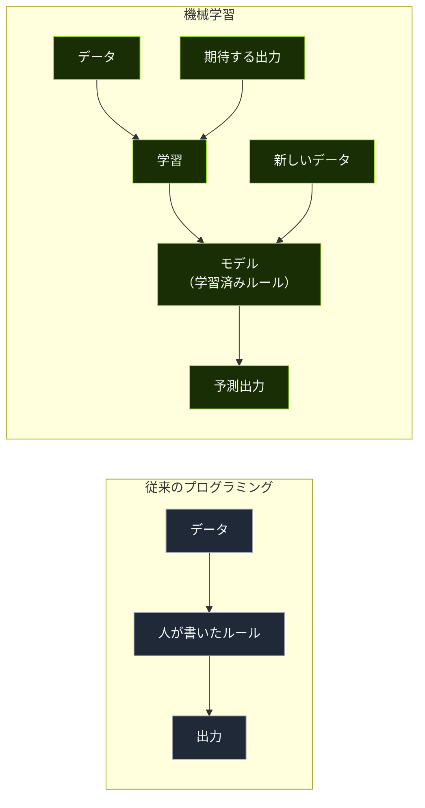
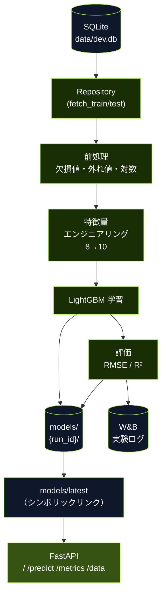
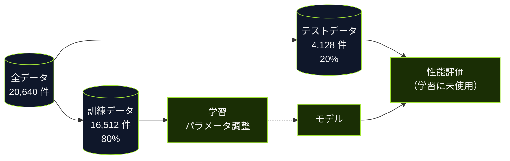
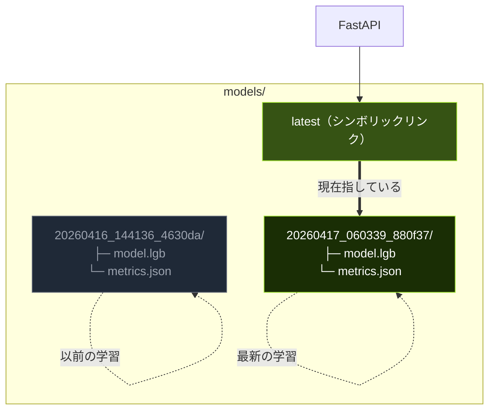
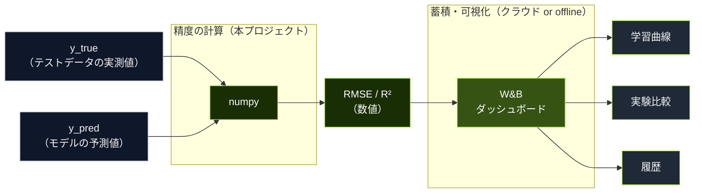
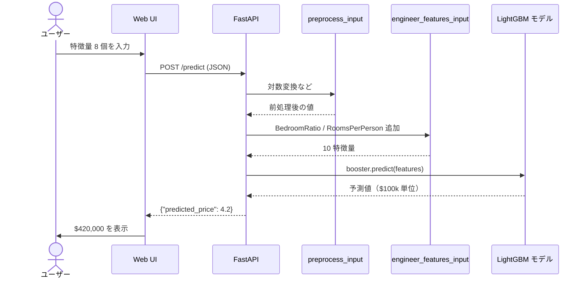

# 図解（Mermaid / PlantUML）

動画内で使う図の定義。Mermaid Live Editor や PlantUML でレンダリング可能。
最終的に PNG/SVG に書き出して編集ソフトに取り込む想定。

---

## Diagram 1: 従来プログラミング vs 機械学習（Ch 1）



**使い方:** Ch 1 冒頭でスライドに全面表示（5 秒）。左ブロックを先に、右ブロックを 1 秒後に点灯させるとより効果的。

---

## Diagram 2: 全体パイプライン（Ch 2 冒頭 or Ch 8 デモ導入）



**使い方:** Ch 8 デモの直前に全体像として再登場させる。各ノードを順番にハイライトしながらナレーションを合わせると効果的。

---

## Diagram 3: 訓練/テスト分割（Ch 3）



**使い方:** 円グラフ 80/20 の代わりにこちらを採用しても良い。テストデータが学習に「使われない」ことを矢印で明示。

---

## Diagram 4: モデルのバージョニング（Ch 6）



**使い方:** Slide 13 の代替として使用可。`latest` が動的に付け替わる様子を、再学習後にアニメーション化すると良い。

---

## Diagram 5: W&B の位置付け（Slide 14-B）



**使い方:** Slide 14-B に配置。「W&B は計算しない。蓄積するだけ」というメッセージを視覚化。

---

## Diagram 6: リクエストから推論結果までの流れ（Ch 6 推論）



**使い方:** Step 5（予測フォームのデモ）の裏で、このシーケンス図をピクチャインピクチャで小さく表示しても良い。

---

## レンダリング手順

### Mermaid

```bash
# Mermaid CLI をインストール
npm install -g @mermaid-js/mermaid-cli

# 各図を PNG に変換
mmdc -i diagram.mmd -o diagram.png -t dark -b '#0a0a0a'
```

または Mermaid Live Editor（https://mermaid.live）に貼り付けて、Theme: dark、Background: transparent でエクスポート。

### PlantUML（代替）

Mermaid で表現しきれない複雑な図がある場合は PlantUML を併用。今回の範囲では不要。

---

## スタイル統一

動画内の図は UI と色を揃えると一体感が出る：

- 背景: `#0a0a0a`（UI のカード色）
- アクセント: `#a3e635`（ライム）
- サブテキスト: `#9ca3af`
- プライマリテキスト: `#f5f5f5`

図の書き出し解像度は **2x**（Retina 対応）を推奨。
